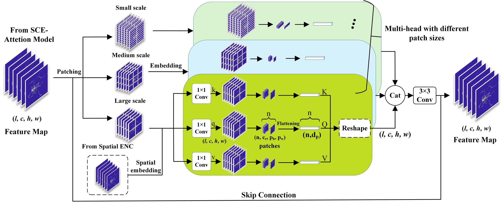

# MD-TLN

<p align="center">
  <strong>A clean PyTorch implementation of MD-TLN for metro passenger flow prediction.</strong>
</p>

<p align="center">
  
  
  
</p>

<p align="center">
  
</p>

This repository contains a cleaned implementation of the MD-TLN method for
metro passenger flow prediction. It is organized from the original project code
and aligned with the Method section of the manuscript.

The repository intentionally excludes experiment-only analysis code, including
station functional labeling, POI clustering, spatiotemporal correlation figures,
heat-map plotting, residual plotting, and result-comparison scripts.

## Highlights

- Multi-source input handling for historical flow, spatial topology, and
  external disturbance features.
- Weather, holiday, and large-scale event feature encoding.
- Entropy-weighted spatial relationship construction.
- Parallel convolutional encoders with spatio-conditional feature fusion.
- Squeeze-and-Channel Excitation attention.
- Multi-scale patch-wise Transformer.
- Decoder with optional auxiliary supervision.
- Training and validation utilities for model development.

## Architecture

### Multi-Scale Patch-Wise Transformer

<p align="center">
  
</p>

## Installation

```bash
pip install -r requirements.txt
```

## Notes For Release

- Keep data files, trained weights, generated figures, and virtual environments
  out of the repository.
- Add a dataset README if public data or processed tensors are released later.
- The implementation keeps the model code separated from experiment analysis so
  reviewers can inspect the proposed method directly.
