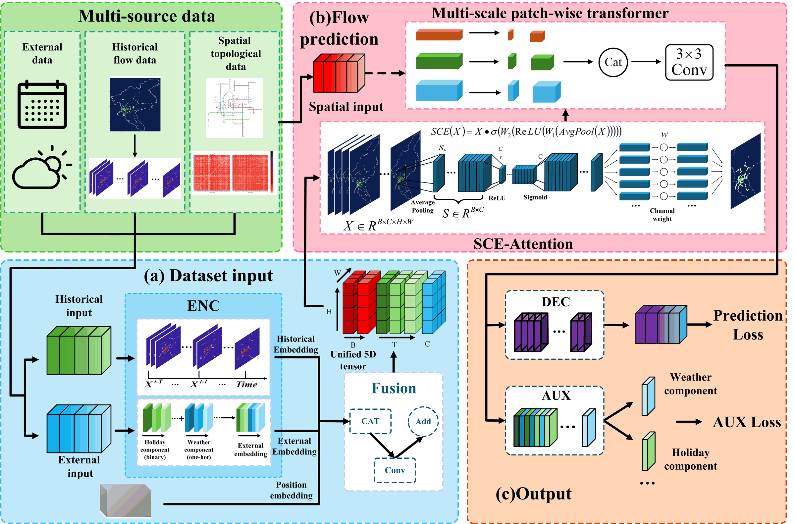

# MD-TLN

<p align="center">
  <strong>A clean PyTorch implementation of MD-TLN for metro passenger flow prediction.</strong>
</p>

<p align="center">
  
  
  
</p>

<p align="center">
  
</p>

MD-TLN is a PyTorch-based model for metro passenger flow prediction with
multi-source feature fusion and multi-scale patch-wise Transformer modeling.

## Highlights

- Multi-source input handling for historical flow, spatial topology, and
  external disturbance features.
- Weather, holiday, and large-scale event feature encoding.
- Entropy-weighted spatial relationship construction.
- Parallel convolutional encoders with spatio-conditional feature fusion.
- Squeeze-and-Channel Excitation attention.
- Multi-scale patch-wise Transformer.
- Decoder with optional auxiliary supervision.
- Training and validation utilities for model development.

## Quick Start

### Environment

- Python 3.10+
- PyTorch 1.13+
- NumPy 1.23+
- Pandas 1.5+
- scikit-learn 1.1+

### Installation

```bash
git clone https://github.com/Lilin-Chen/MD-TLN.git
cd MD-TLN
pip install -r requirements.txt
```

### Verify Installation

```bash
python scripts/verify_installation.py
```

If the script finishes without errors, the environment and model pipeline are
ready.

### Run With Data

```bash
python scripts/run_txt_experiment.py --data-files path/to/data.txt
```

The script reads prepared AFC data files, builds station-grid tensors, and runs
the training pipeline.

For multiple files:

```bash
python scripts/run_txt_experiment.py --data-files file_1.txt file_2.txt file_3.txt
```

## License

This project is released under the MIT License. See [LICENSE](LICENSE) for
details.
